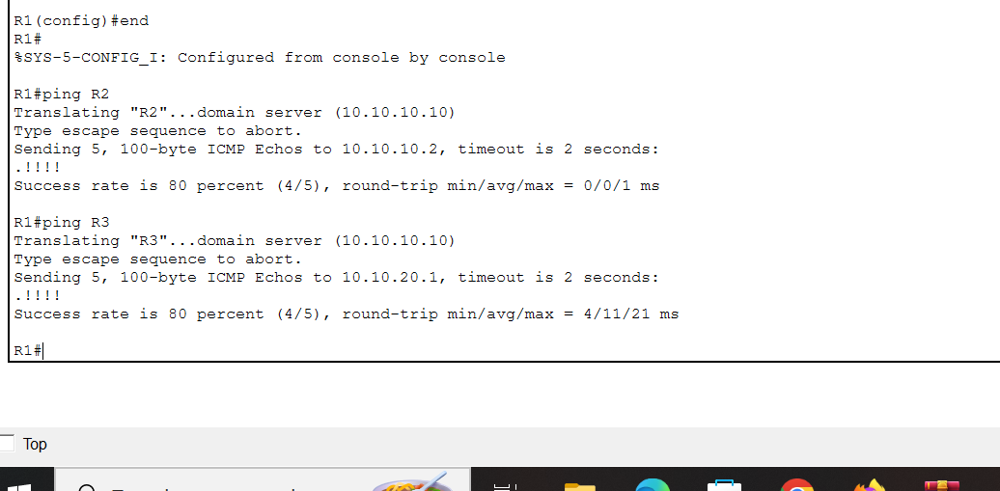
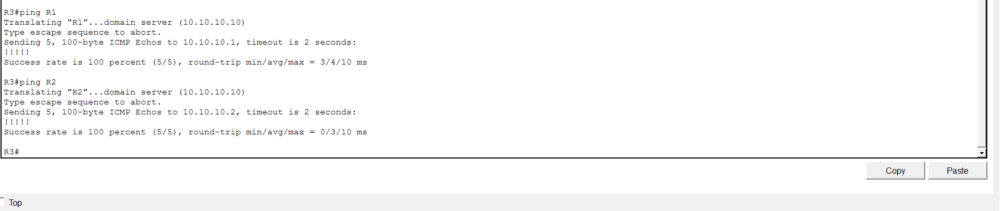
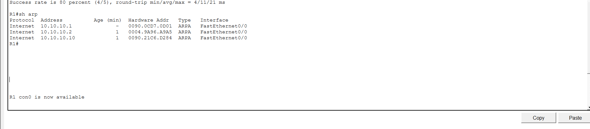
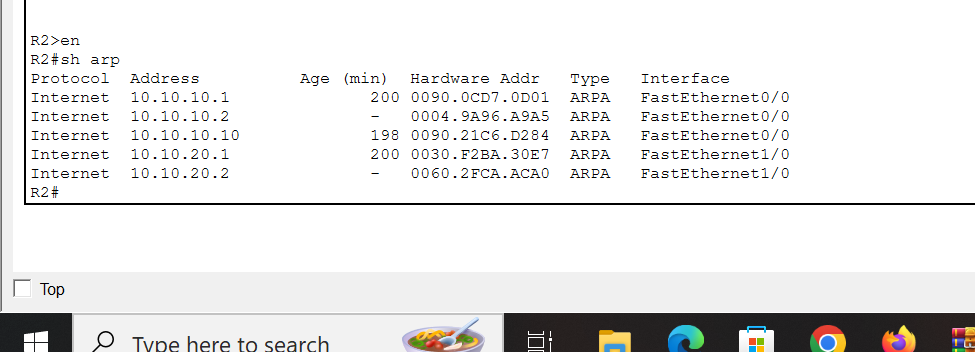
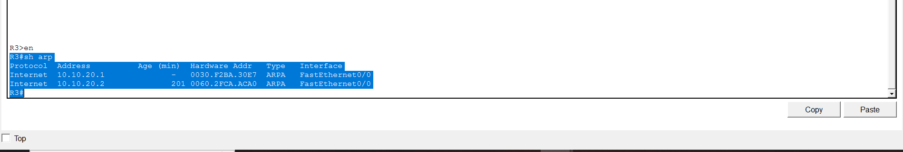

# 🌐 DNS Client & ARP Cache Lab

## 📋 Overview
This project demonstrates DNS client configuration and ARP cache behavior using Cisco routers in Packet Tracer. The DNS server is set to 10.10.10.10, and routers (R1, R2, R3) are configured to resolve hostnames.

## 🖼️ Topology Diagram

## 📊 Device Table

| Device      | Interface     | IP Address     | Role         |
| ----------- | ------------ | -------------- | ------------|
| DNS-Server  | F0           | 10.10.10.10    | DNS Server  |
| R1          | F0/0         | 10.10.10.1     | Router      |
| R2          | F0/0, F1/0   | 10.10.10.2, 10.10.20.2 | Router |
| R3          | F0/0         | 10.10.20.1     | Router      |

## 📝 Prerequisites
- Cisco Packet Tracer (or GNS3)
- Provided topology file
- Initial configs files for R1, R2 & R3

## ⚙️ Router Configuration Steps

R1(config)# ip domain-lookup
R1(config)# ip name-server 10.10.10.10

R2(config)# ip domain-lookup
R2(config)# ip name-server 10.10.10.10

R3(config)# ip domain-lookup
R3(config)# ip name-server 10.10.10.10

## ✅ Verification

### 1. 🏓 Ping by Hostname from R1
- Run: `ping R2`
- Run: `ping R3`
- Screenshots here

### 2. 🏓 Ping by Hostname from R3
- Run: `ping R1`
- Run: `ping R2`
- Screenshots here

## 🔍 ARP Cache Analysis

### 📌 Expected Behavior
- ARP entries only for hosts on directly connected networks
- R1 will not see R3 in ARP cache

## 🔍 ARP Cache Outputs

### R1 ARP Cache

**Analysis:** R1 has ARP entries for devices on its directly connected network (10.10.10.0/24) including R2 and the DNS server. R1 does not have an entry for R3 (10.10.20.1) because it is not directly connected to that network.

### R2 ARP Cache

**Analysis:** R2 is connected to both subnets (10.10.10.0/24 and 10.10.20.0/24), so it has ARP entries for devices on both networks. R2 serves as the gateway between the two networks.

### R3 ARP Cache

**Analysis:** R3 only has ARP entries for devices on its directly connected network (10.10.20.0/24). R3 does not have entries for devices in the 10.10.10.0/24 network because it is not directly connected to that subnet.

### 📌 Key Observations
- ARP operates only on directly connected networks; routers do not forward ARP requests
- Devices with '-' age are the router's own interfaces (Age shows as '-')
- Age (min) shows how long ago the ARP entry was learned (higher age = older entry)
- Each router only maintains ARP entries for hosts on its directly connected subnets

## 👤 Author
**Rajnish Kumar**
- GitHub: [@rajnish-kumar](https://github.com/hll0raj/)
- Email: rajnishsharma281999@gmail.com

