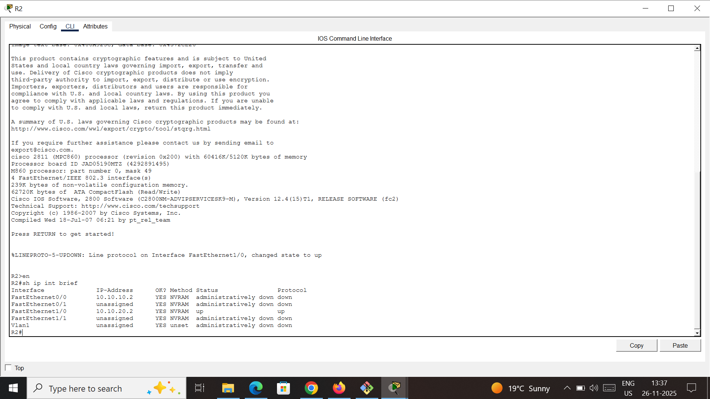
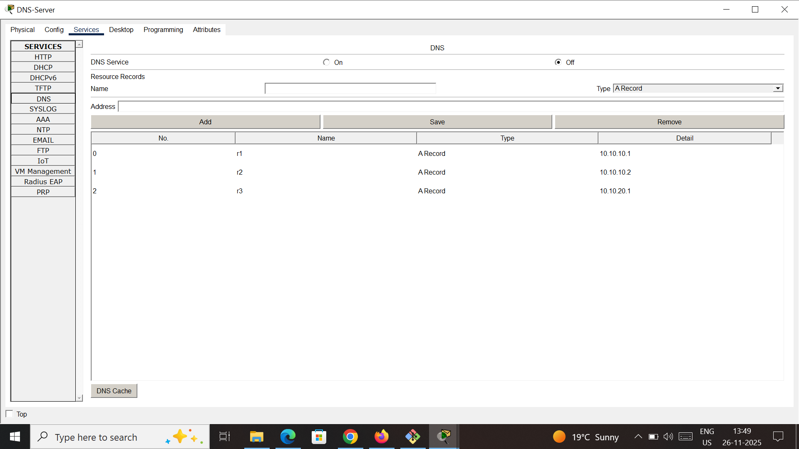

# Troubleshooting Connectivity to DNS Server (Packet Tracer Lab)

This lab focuses on troubleshooting DNS connectivity issues in a Cisco Packet Tracer environment.  
The goal is to identify and fix multiple problems so that router **R3** can successfully resolve and ping **R1** by hostname using a DNS server.

---

## Lab Overview

- **DNS Server IP:** `10.10.10.10`
- **Devices involved:** `R1`, `R2`, `R3`, DNS server (Packet Tracer server device)
- **Objective:**  
  Ensure that from **R3** you can ping **R1** using its **hostname** via DNS
  
  Problem Description

Members of staff report that DNS is not working:

R3 cannot resolve hostnames such as R1, R2, and R3.

Initial Telnet and ping tests to the DNS server at 10.10.10.10 fail.

The issue is affecting all users, so the problem is likely on the server side or network, rather than just a single host.

## Network Topology

Step-by-Step Troubleshooting
1. Verify Connectivity to DNS Server from R3

Attempt to connect to the DNS server using Telnet:
R3#telnet 10.10.10.10
Trying 10.10.10.10 ...
% Connection timed out; remote host not responding
R3#
This indicates a connectivity issue, not just an application-layer DNS problem.
Next ping the dns server
R3# ping 10.10.10.10

Type escape sequence to abort.
Sending 5, 100-byte ICMP Echos to 10.10.10.10, timeout is 2 seconds:
U.U.U
Success rate is 0 percent (0/5)
Ping fails, confirming a network-layer problem.

2. Use Traceroute to Locate the Break
R3# traceroute 10.10.10.10

Type escape sequence to abort.
Tracing the route to 10.10.10.10

 1 10.10.20.2 0 msec 0 msec 0 msec
 2 10.10.20.2 !H * !H
 3 * *

Traceroute reaches R2 (10.10.20.2) but cannot proceed further.
This suggests:

    R3 has a valid route toward the DNS server.

    The issue is likely between R2 and the DNS server on the 10.10.10.0/24 network.

3. Check Interfaces on R2

R2# show ip interface brief

The interface FastEthernet0/0 (facing the 10.10.10.0/24 network and DNS server) is administratively down.
Fix: Enable the Interface

R2(config)# interface FastEthernet0/0
R2(config-if)# no shutdown

4. Re-test Connectivity from R3

R3# ping 10.10.10.10

Type escape sequence to abort.
Sending 5, 100-byte ICMP Echos to 10.10.10.10, timeout is 2 seconds:
..!!!
Success rate is 60 percent (3/5), round-trip min/avg/max = 0/0/0 ms

Connectivity to the DNS server is now mostly working (first few pings may fail due to ARP resolution).
Next, test DNS resolution.
5. Test DNS Resolution from R3

R3# ping R1
Translating "R1"...domain server (10.10.10.1)
% Unrecognized host or address or protocol not running.

The error shows that R3 is using DNS server 10.10.10.1, which is incorrect.
The correct DNS server IP is 10.10.10.10.
6. Correct DNS Server Configuration on R3

Remove the incorrect DNS server entry and configure the correct one:

R3(config)# no ip name-server 10.10.10.1
R3(config)# ip name-server 10.10.10.10

Test again:

R3# ping R1
Translating "R1"...domain server (10.10.10.1)
% Unrecognized host or address or protocol not running.

The error still appears, which means the problem is likely on the DNS server itself, not on R3 anymore.
7. Verify DNS Service on the Server

On the Packet Tracer server at 10.10.10.10:

    Click the DNS server.

    Go to the Services tab → DNS section.

    Verify:

        The DNS service is ON.

        There are A records for:

            R1

            R2

            R3

In this case:

    The address records exist, but

    The DNS service is turned OFF.

Fix: Enable DNS Service

    Toggle the DNS service to ON on the server.

8. Final Test from R3

R3# ping R1
Translating "R1"...domain server (10.10.10.10)
Type escape sequence to abort.
Sending 5, 100-byte ICMP Echos to 10.10.10.1, timeout is 2 seconds:
!!!!!
Success rate is 100 percent (5/5), round-trip min/avg/max = 0/0/4 ms

R3 can now successfully resolve and ping R1 by hostname.
The DNS setup and network connectivity are working correctly.
Issues Identified and Resolved

    R2 FastEthernet0/0 administratively down

        Interface between R2 and 10.10.10.0/24 (DNS network) was shut.

        Fixed with no shutdown on FastEthernet0/0.

    R3 using wrong DNS server IP

        Configured DNS server IP was 10.10.10.1 instead of 10.10.10.10.

        Fixed by updating ip name-server to 10.10.10.10.

    DNS service disabled on the server

        DNS A records existed, but the service was turned off.

        Fixed by enabling the DNS service on the Packet Tracer server.

Author

Rajnish Kumar
📧 Email: rajnishsharma281999@gmail.com
